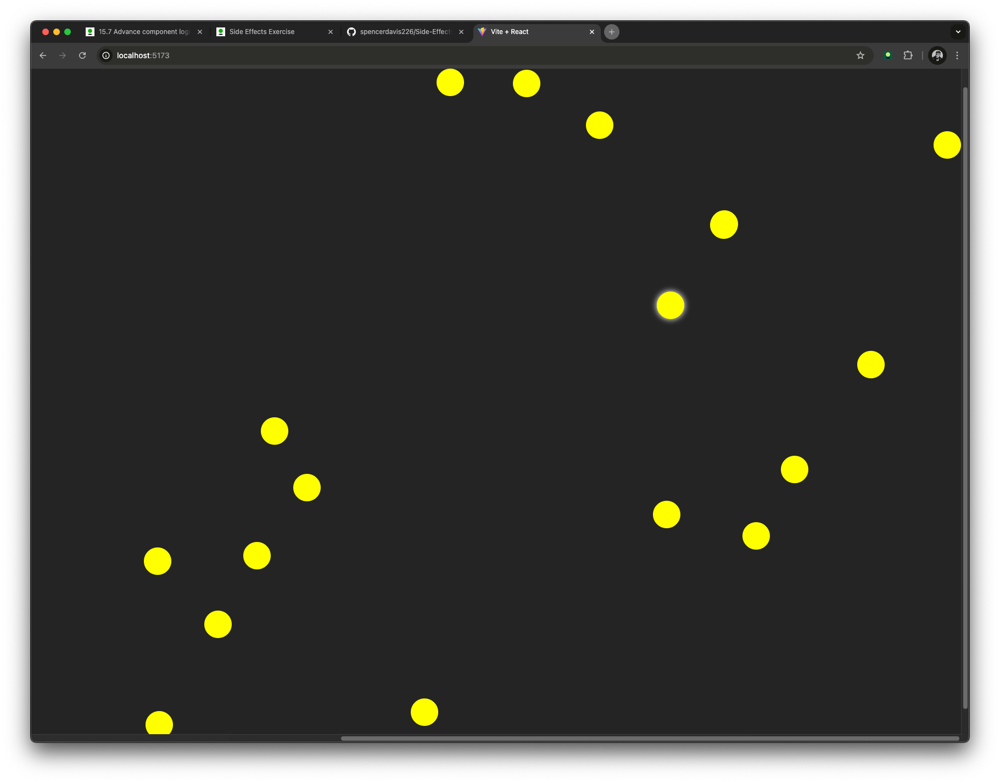

# Star Destroyer 🌠

Star Destroyer is a simple React application that demonstrates the use of hooks (`useEffect` and `useRef`) to manage side effects and DOM interactions. The app dynamically generates stars at random positions every 2.5 seconds, and each star can be destroyed with a click.

## Screenshot

## Features

- **Dynamic Star Generation:** A new star is created every 2.5 seconds using `useEffect`.
- **Random Positioning:** Stars appear at random positions within the viewport.
- **Interactive Destruction:** Click a star to remove it from the screen.
- **Focus Management:** Each star automatically receives focus on mount, with visual effects applied via `useRef`.

## Built With

- React
- Vite
- JavaScript (ES6+)

## Getting Started

To run this application locally:

1. Clone the repository using your preferred Git client.
2. Install the dependencies (for example, run "npm install" in your terminal).
3. Start the development server (for example, run "npm run dev").
4. Open your browser and navigate to the URL provided by the development server.

## License

This project is licensed under the MIT License.
